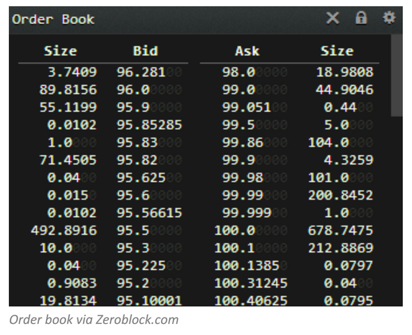

Welcome to Yamex!

Yamex is the next-gen market exchange engine that will probably drives all EURO, AMER and ASIA trading platform.

A central part of a market exchange engine is the matching engine.
A matching engine is a program that accepts orders from buyers and sellers. The other matching module matches buy and sell orders, creates transactions to record the process, and updates the customers account balances.

The matching (or trade allocation) algorithm is an important part of an exchange trading mechanism, since it is responsible for resolving the buy/sell association in a fast and efficient way.


# First Iteration: "The Law and Order"

Exchanges set the institutional rules that govern trading and information flows about that trading. They are closely linked to the clearing facilities through which post-trade activities could be completed. An exchange centralizes the communication of bid and offer prices to all direct market participants, who can respond by selling or buying at one of the quotes or by replying with a different quote.

The market exchange platform must allow broker to take order either buy or sell.
All orders are created by brokers, are either to sell or to buy a given instrument, and have a known size and quantity.

> A customer enters the quantity and prices of the orders and clicks “buy” or “sell”

It then creates record with Pending order status.


```java
public enum Side {
  Buy,
  Sell
}
```

```java
public interface Broker {
  String name();
}
```

```java
public enum OrderStatus {
  Pending
}
```

```java
public interface Order {
  Side side();
  Broker broker();
  double quantity();
  OrderStatus status();
}
```

```java
public interface OrderId {
}
```


```java
public interface MarketExchange {
  OrderId takeOrder(Order order);
  Option<Order> findById(OrderId id);
}
```


* buy/bid
* sell/offer

```gherkin
Feature: Basic Order Processing

  Scenario: Take a sell order

    When broker "A" take a sell order of 150 YAMX for 10.5€
    Then the market exchange should have created the following record:
      | Broker | Side | Qty | Price | Status  |
      | A      | Sell | 150 | 10.5  | Pending |
```

Any time an order is processed, it is required to re-verify order status to ensure that it is still pending/active.

It is also required to be able to Validate the order funding.
The broker must have sufficient assets to process the order. If not, the order is Suspended (it may be re-actived if funds become available later.)


```java
public interface OrderFundingValidation {
  boolean validateOrderFunding(Order order);
}
```


If order passes validation:

1. the order status is changed to Active
2. the assets needed to pay for the order are added to the Frozen balance. The prevents the broker from placing orders on more assets than he has. (**Note** This feature may be removed later – we can allow spending greater than the available balance if we check the balance before processing the transaction).

```java
public interface AssetInfo {
  double available();
  double frozenAmount();
}
```

```java
public interface LimitOrder extends Order {
  double limit();
}
```


Limit orders, in addition, define a limit price, and will not execute if market conditions are inferior to the limit price.
The motivation of market makers to place limit orders is to “buy low and sell high”. Thus, a market maker would prefer as large spread between his bid and offer as possible.


`00-standard/01-limit-order.feature`

```gherkin

Feature: Standard limit order

# In order to ease the scenario's writing and reading, standard are defined with
# default and pertinent values.
#```ditaa
#
# /----------\ 1       /--------------\          1 /----------\
# | Broker   |<--------|  Limit Order |----------->| <<enum>> |
# +----------+         +--------------+            |   Side   |
# | + name   |         | + quantity   |            +----------+
# \----------/         | + limit  cGRE|            | buy      |
#                      \--------------/            | sell     |
#                                                  \----------/
#```

@standard @limitOrder
Scenario: Standard sell limit order

  Given a standard sell limit order from broker A
   Then the order should have the following specifics:
     | Broker | Qty | Price | Side |
     | A      | 100 | 10.0  | Sell |

@standard @limitOrder
Scenario: Standard sell limit order

  Given a standard buy limit order from broker A
   Then the order should have the following specifics:
     | Broker | Qty | Price | Side |
     | A      | 100 | 10.0  | Buy  |

```


# Second Iteration: Order Book and timestamp

Then, there’s the order book, which keeps track of buyers’ and sellers’ interests. At every price level, this book records open 'buy' and 'sell' orders, including their cumulative sizes.

When an order is entered into the order book, it is assigned a timestamp. This timestamp can be used to prioritize orders, when other criteria are identical, the order entered earliest gets executed first.

```java
public interface BookEntry {
  Order order();
  Timestamp timestamp();
}
```

```java
public interface OrderBook {
  void add(Order order);
  Stream<BookEntry> entries();
}
```

```gherkin
@technical @orderBook @timestamp
Scenario: Timestamp are automatically assigned on order

  Given An order book initialized with a sequential timestamp starting at 6
   When the following standard orders are added to the order book:
    | Broker | Side |
    | A      | Sell |
    | B      | Buy  |
    | C      | Sell |
    | D      | Sell |
   Then the order book should looks like (whatever the actual order):
    | Broker | Side | Timestamp |
    | C      | Sell | 8         |
    | A      | Sell | 6         |
    | B      | Buy  | 7         |
    | D      | Sell | 9         |
```

# Third Iteration: Price / Time Priority

Often you’ll see order books displayed as tables showing open buy orders (known as 'bids') and sell orders (known as 'asks') at price levels below and above the last market price:



For all products, the best bid and ask prices, as well as their respective aggregated bid and offer sizes (also known as the inside market), are always available in real time.

```java
public interface OrderBook {
  Option<BookEntry> topEntry(Side side);
}
```

```gherkin

Scenario: Price / Time Priority for Limit order - Sell by ascending price order

  Given An order book initialized with the "Price / Time" priority and sequential timestamp
   When the following orders are added to the order book:
    | Broker | Qty | Price | Side |
    | A      | 100 | 10.6  | Sell |
    | B      | 100 | 10.7  | Sell |
    | C      | 100 | 10.5  | Sell |
    | D      | 100 | 10.7  | Sell |
   Then the order book - for the Sell orders - should looks like:
    | Broker | Qty | Price | Timestamp |
    | C      | 100 | 10.5  | 3         |
    | A      | 100 | 10.6  | 1         |
    | B      | 100 | 10.7  | 2         |
    | D      | 100 | 10.7  | 4         |
   And the top Sell order should correspond to the order from broker C


Scenario: Price / Time Priority for Limit order - Buy by descending price order

  Given An order book initialized with the "Price / Time" priority and sequential timestamp
   When the following orders are added to the order book:
    | Broker | Qty | Price | Side |
    | A      | 100 | 10.6  | Buy  |
    | B      | 100 | 10.7  | Buy  |
    | C      | 100 | 10.5  | Buy  |
    | D      | 100 | 10.7  | Buy  |
   Then the order book - for the Buy orders - should looks like:
    | Broker | Qty | Price | Timestamp |
    | B      | 100 | 10.7  | 2         |
    | D      | 100 | 10.7  | 4         |
    | A      | 100 | 10.6  | 1         |
    | C      | 100 | 10.5  | 3         |
    And the top Buy order should correspond to the order from broker B

```

Furthermore, Order book provides an aggregated view of the quantities for a given price.

```gherkin
Scenario: Unless specified an order book is initialized with the "Price / Time priority" strategy

  Given an default order book
   Then the order book's priority strategy should be "Price / Time priority"
    And the order book's timestamp strategy should be sequential based
```

```gherkin
Scenario: Aggregated view of quantities per price - Sell order book

  Given an default order book
   When the following orders are added to the order book:
    | Broker | Qty | Price | Side |
    | A      | 100 | 10.6  | Buy  |
    | B      | 150 | 10.7  | Buy  |
    | C      |  50 | 10.5  | Buy  |
    | D      | 200 | 10.7  | Buy  |
   Then the order book aggregated view - for the Buy orders - should looks like:
    | Qty | Price |
    | 350 | 10.7  |
    | 100 | 10.6  |
    |  50 | 10.5  |
```

# Fourth iteration: When regulation comes in action!

To satisfy regulation constraint, it is required that each order trigger a log event in the audit trail.

```java
public interface EventType {
  String format(AuditEvent event);
}

public class AuditEvent {
  public AuditEvent(EventType eventType,
                    Timestamp createdAt,
                    Object...args) {...}
}

public interface AuditTrail {
  void emit(AuditEvent event);
}
```


# Fifth iteration: Order expires!

If expired, the order is Cancelled.

```gherkin
Feature: Basic Order Processing

  Scenario: Take a sell order with expiration date

    # Note: Central European Summer Time (CEST) is 2 hours ahead of Coordinated Universal Time (UTC).
    # This time zone is a DST (daylight saving time) time zone and is used in: Europe, Antarctica.
    # This time zone is often called Central European Summer Time.

    Given the current time is 2015-MAY-16 14:30:00 CEST
    When broker "A" take a standard sell order with an expiration time of 16:30
    Then the market exchange should have created the following record:
      | Broker | Side | Qty | Price | Status  |
      | A      | Sell | 150 | 10.5  | Pending |
    When the current time becomes 16:31:00 CEST
    Then the market exchange should have the following record:
      | Broker | Side | Qty | Price | Status  |
      | A      | Sell | 150 | 10.5  | Expired |
```

# Matching Principles

When orders and quotes are entered into the central order book, they are sorted by type, price and entry time. Market orders are always given the highest priority for matching purposes. Limit orders and quotes are sorted together; there is no special consideration given to Market Maker quotes.

Orders and quotes in the central order book are anonymous: A trader never knows the opposite side on a trade executed through the exchange. Yamex Clearing SA is always the counterparty. Orders and quotes at a given price level are aggregated, although the number of orders and quotes making up the total remains unknown. Participants only see the specific details of their own orders.

For all products, the best bid and ask prices, as well as their respective aggregated bid and offer sizes (also known as the inside market), are always available in real time. In many cases, these bid and ask prices are derived synthetically. For options and futures as well as for futures time spreads (futures calendar spreads) Eurex provides the depth of the order book dynamically for at least the ten best price levels, with sizes, on both sides.


## Price / Time priority


### Description

Time-based priority allocation

### Allocation

Full order allocation offered to the oldest (priority) order at the best bid/offer.

### Priority

### Details

The principle of price/time priority refers to both orders and quotes. When an order (or quote) is entered into the order book, it is assigned a timestamp. This timestamp is used to prioritize orders in the book with the same price - the order entered earliest at a given price limit gets executed first. When a new order (or quote) is entered, the Eurex® system first checks the limits of all orders contained in the central order book. If the incoming order is immediately executable, meaning it is capable of being matched against an existing order or orders, one or more transactions are generated. To be immediately executable, the order must be:

A market order, where opposite already exist in the central order book;
an order to buy at a price at or above the lowest offer in the central order book;
an order to sell at a price at or below the highest bid in the book.

Orders may not necessarily be executed at a single price, but may generate several partial transactions at different prices. When a large order executes against the total available quantity at a given price level, the next best price level becomes best. This process continues as long as the incoming order remains executable. If not executed upon entry, an order is held in the central order book.

Also, it is possible for a single order to generate multiple executions at different points in time. For example, an order may generate a partial execution upon entry, while the remaining open order remains in the order book. The open portion may get executed a minute later, an hour later, or even a day later, if its validity extends beyond the current trading day.

All executions are subject to the restrictions of the market order matching range.

Market orders have the highest priority for matching. Since the purpose of the market order is to be executed as quickly as possible at the best possible price, it must be entered without execution restrictions. If several market orders are booked in the order book, the Eurex® system takes into account the timestamp of the orders to establish matching priority. The earliest market order entered receives the highest priority.

In the case of limit orders, orders with the best possible prices (highest price limit for buy orders, lowest price limit for sell orders) always take precedence in the matching process over other orders with worse prices. Again, if the limit orders have the same price limit, the criterion used for establishing matching priority is the order timestamp.

The orders already present in the order book are always executed at their specified limit price. Price improvements for orders in the order book are only possible during an auction process - opening or closing auction. Orders going into the order book are always matched at the appropriate prices available in the order book, up to the specified limit price.

## Order types

### Limit Orders

> *Limit Orders*
> A limit order stipulates a maximum purchase price or minimum selling price.
> A limit order can be placed during the order accumulation period and during the main trading session. A limit order entered during the trading session is executed either fully or partially, as market conditions permit. Failing this, it is logged in the order book in descending buy-price order or ascending sell-price order (the price-priority principle) and joins the queue of orders having the same price (the time-priority principle).
>
> -- Order Types, NYSE Euronext

### Market Orders


## Resources

* [NYSE Euronext - Order Types](www.nyseeuronext.com)
* [Matching Algorithms on the LIFFE CONNECT® Financials Trading Host](www.nyseeuronext.com)
* [Matching Algorithms of International Exchanges, 2007 - Karel Janecek, Martin Kabrhel](???)
* [Eurex Exchange - Order Types](http://www.eurexchange.com/exchange-en/trading/market-model/order-types)
* [Eurex Exchange - Matching principles](http://www.eurexchange.com/exchange-en/trading/market-model/matching-principles)
