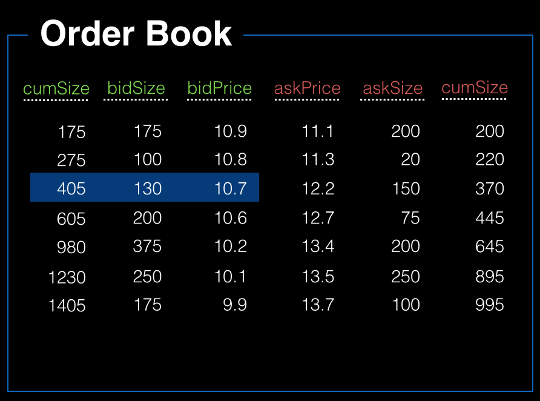

Third Iteration: Price / Time Priority
================================================================================

Often you’ll see order books displayed as tables showing open buy orders (known as 'bids') and sell orders (known as 'asks') at price levels below and above the last market price:

For all products, the best bid and ask prices, as well as their respective aggregated bid and offer sizes (also known as the inside market), are always available in real time.

Furthermore, Order book must provide an aggregated view of the quantities for a given price.

**buy, sell, bid, ask, offer...**!!
