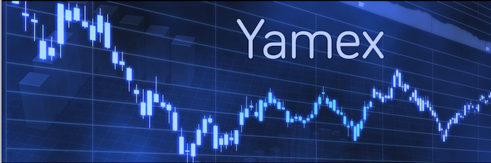

Welcome to Yamex!

Yamex is the next-gen market exchange engine that will probably drives all EURO, AMER and ASIA trading platform.

A central part of a market exchange engine is the matching engine.
A matching engine is a program that accepts orders from buyers and sellers. The other matching module matches buy and sell orders, creates transactions to record the process, and updates the customers account balances.

The matching (or trade allocation) algorithm is an important part of an exchange trading mechanism, since it is responsible for resolving the buy/sell association in a fast and efficient way.

Exchanges set the institutional rules that govern trading and information flows about that trading. They are closely linked to the clearing facilities through which post-trade activities could be completed. An exchange centralizes the communication of bid and offer prices to all direct market participants, who can respond by selling or buying at one of the quotes or by replying with a different quote.

This specification describes the matching engine expected behaviors.

# Terminology

* **Order** - An order is an instruction to buy or sell a stock at a specific price or better
* **Bid** - the price in a buy order
* **Ask** - the price in a sell order
* **Spread** - the difference between the bid and the ask
* **Time In Force** - indicates how long an order will remain active (see Appendix B)

# Order Types

Market Exchange supports a variety of order types, some of which are even customized to favor certain market participant.
In order to simplify the model, Yamex will only - at first - support the following order types (see appendix for complete description):

* Limit Order
  * Iceberg Order
* Market Order
* Stop Order

See Appendix A for more details.

## Interface and API

| Order Type   | Identifier | Time In Force          | Std Parameters   | Additional Parameters     |
| ------------ | ---------- | -----------------------| ---------------- | ------------------------- |
| Limit Order  | LO         | fok, ioc, gtc, gtd, do | Limit price      | iceberg volume (visible)  |
| Market Order | MO         | fok, ioc               |  -               | -                         |
| Stop Order   | SO         | gtc, gtd, do           | Activation price | -                         |

# System Overview


Orders and quotes in the central order book are anonymous: A trader never knows the opposite side on a trade executed through the exchange. Yamex is always the counterparty. Orders and quotes at a given price level are aggregated, although the number of orders and quotes making up the total remains unknown. Participants only see the specific details of their own orders.

For all products, the best bid and ask prices, as well as their respective aggregated bid and offer sizes (also known as the inside market), are always available in real time. In many cases, these bid and ask prices are derived synthetically.


# Matching Principles

When orders and quotes are entered into the central order book, they are sorted by type, price and entry time. Market orders are always given the highest priority for matching purposes. Limit orders and quotes are sorted together; there is no special consideration given to Market Maker quotes.

All products at Yamex Exchange follow the matching principle known as price/time priority.

## Price/Time priority

The principle of price/time priority refers to both orders and quotes.

When an order (or quote) is entered into the order book, it is assigned a timestamp. This timestamp is used to prioritize orders in the book with the same price - the order entered earliest at a given price limit gets executed first (FIFO). When a new order (or quote) is entered, the Yamex system first checks the limits of all orders contained in the central order book. If the incoming order is immediately executable, meaning it is capable of being matched against an existing order or orders, one or more transactions are generated.

To be immediately executable, the order must be:

* A market order, where opposite already exist in the central order book;
* an order to buy at a price at or above the lowest offer in the central order book;
* an order to sell at a price at or below the highest bid in the book.

Orders may not necessarily be executed at a single price, but may generate several partial transactions at different prices. When a large order executes against the total available quantity at a given price level, the next best price level becomes best. This process continues as long as the incoming order remains executable. If not executed upon entry, an order is held in the central order book.

Also, it is possible for a single order to generate multiple executions at different points in time. For example, an order may generate a partial execution upon entry, while the remaining open order remains in the order book. The open portion may get executed a minute later, an hour later, or even a day later, if its validity extends beyond the current trading day.

All executions are subject to the restrictions of the market order matching range.

Market orders have the highest priority for matching. Since the purpose of the market order is to be executed as quickly as possible at the best possible price, it must be entered without execution restrictions. If several market orders are booked in the order book, the Eurex® system takes into account the timestamp of the orders to establish matching priority. The earliest market order entered receives the highest priority.

In the case of limit orders, orders with the best possible prices (highest price limit for buy orders, lowest price limit for sell orders) always take precedence in the matching process over other orders with worse prices. Again, if the limit orders have the same price limit, the criterion used for establishing matching priority is the order timestamp.

The orders already present in the order book are always executed at their specified limit price. Price improvements for orders in the order book are only possible during an auction process - opening or closing auction. Orders going into the order book are always matched at the appropriate prices available in the order book, up to the specified limit price.


## Matching rules

The matching engine supports the following order queues:

* Cancel order queue
* Market order queues
  * Buy
  * Sell
* Limit order queue
  * Buy
  * Sell
* Stop order queue
  * Buy
  * Sell

Orders are processed in the order listed above. Cancel orders are processed first, followed by market order, limit orders and stop order.

* Orders may be partially filled or not filled at all (in the case of a limit order).
* After cancel orders, market orders are given the highest priority and will execute immediately when an opposite order exists in the market. Market orders may be partially filled, at different prices.
* An attempt is always made to match a buy order first, against existing sell orders.
* Limit orders are sorted:
  * Buy orders are sorted in descending order by their bid price and ascending order by time stamp for orders that have the same price. Orders with the highest bid (buy) price are kept at the top of the queue and will be executed first. For equal priced bids, the order that arrives first is executed first.
  * Sell orders are sorted in ascending order by their ask price, and like buy orders, by ascending order by time stamp for orders with the same price. Orders with the lowest sell (ask) prices will be sold first. For orders with the same ask price, the order that arrives first will be sold first.

When an order completes, either because it is filled, canceled or expires, a status message is returned to the agent that submitted the order.

## Design Considerations

```ditaa
                                                             +-------------+
                                                     /------ | Market Book |
/--------------\     submit order  /-------------\   |       +-------------+
| Electronic   | ----------------> | Transaction |---/              .
| Trading      |                   | Router      |------ ...        .
| Network cBLK | <---------------- |             |---\              .
\--------------/   order status    \-------------/   |       +-------------+
                                                     \-------| Market Book |
                                                             +-------------+
```

A client connects to the Transaction Router via a known (predefined) TCP/IP port. The Transaction Router then creates a thread to handle the transactions from that client.

An instance of the matching engine is created for each stock that is traded. This matching engine processes the orders for that stock. The result of the order processing is the order book with the current bid/ask spread.


```ditaa
+---------------------------------------+
| Market Book                           |
|              +---------------------+  |
|              | Cancel Queue        |  |
|              +---------------------+  |
|              | Market Order Queue  |  |
|              +---------------------+  |
|              | Limit/Stop Order Q. |  |
|              +---------------------+  |
|                                       |
+---------------------------------------+
```

When the Transaction Router receives an order, it submits it to the associated queue (Market, Limit or Cancel).

* The cancel queue contains the cancel requests.
* The Market Order Queue contains queues the market orders for execution. Internally the market order queue implements a queue for buy and sell orders. A market order is at least partially filled as soon as an opposite order is present in the market. Orders are executed in first in, first executed priority.
* The Limit Order Queue contains limit and stop orders. Internally this logical queue supports buy and sell queues for limit orders and stop orders. **When the market price point is reached for a stop order, it is converted to a market order and submitted to the market order queue**. The Limit Order Queue supports order cancellation and order expiration.
* The Order Matching Engine matches orders from the queues following the rules outlines above. When a order is filled or canceled, the status is reported back to the market actor by entering the status in the return status queue.

The “order book” consists of the orders at the heads of the queues. These orders represent the current best prices for bids and asks.

## Market Protocols

### **Order**

1. Broker ID (a unique identifier for the market customer)
2. Stock ID (usually the CUSIP number)
3. Order type (buy/sell)
4. Order class (market, limit, stop)
5. Unit price (i.e., target price for a limit order)
6. Number of shares (to be bought or sold)
7. Partial fill allowed (for limit orders): 1 = partial fill allowed, 0 = no partial fill
9. Expire time (time the order should be active in the market, in minutes)

### **Acknowledgment**

The order acknowledgment or an error status is returned immediately when the order is accepted. The acknowledgment is sent in response to order or cancels.

1. Status (e.g., order accepted, error, etc...)
2. Market order ID (identifier assigned by the market for this order)
3. Timestamp (time the order was accepted)

The market order ID will be the identifier that is used in reporting the order result or in order cancellation.

### **Order cancel**

1. Broker ID
2. Market order ID

### **Order Result**

An order result is returned when an order is filled (or at least partially filled), when the order is canceled or when the order expires. Market orders (or stop orders that convert to market orders) may have more than one fill, at different prices.

1. Broker ID
2. Market order ID
3. Timestamp
4. Status: filled, expired, canceled
5. Number of fills [{number of shares, fill price}]*

A limit order that allows a partial fill will complete when the limit order is partially filled.


# Services/API

The Matching Engine must provide access to:

* the best bid/ask price and corresponding accumulated size
* all orders that belongs to the authentified broker
* orderbook views


# Appendix A - Order Types


## Limit Order

A limit order is an order to buy or sell a contract at a specific price or better.
A **buy** limit order can only be executed at the **limit price or lower**, and a **sell** limit order can only be executed at the **limit price or higher**.
Use of a Limit order helps ensure that the customer will not receive an execution at a price less favorable than the limit price. Use of a Limit order, however, does not guarantee an execution.

* A buy limit order for AAPL at $125 will buy shares of IBM at $125 or less.
* A sell limit order for AAPL at $125 will sell shares of IBM for $125 or more.
* A limit order must have a Time in Force (TIF) value

In our system we support Limit Orders with various time in force parameters. Fill-or-Kill (FoK), Immediate-or-Cancel (IoC) works the same way as for Market Orders. Good-Till Date or Good-Till-Cancel and Day Orders are valid until specified time requested by investor and cancelled after that.

### Iceberg Order


An iceberg order is a type of order placed on a exchange. The total amount of the order is divided into a visible portion, which is reported to other market participants, and a hidden portion, which is not. When the visible part of the order is fulfilled, a new part of the hidden portion of the same size becomes visible.

In our system only limit orders can be placed with Iceberg parameter.

Iceberg orders generally specify an additional "display quantity"—i.e., smaller than the overall order quantity, leaving a large undisplayed quantity "below the surface"


## Market Order

A market order is an order to buy or sell a contract at the best available price.  Generally, this type of order will be executed immediately.  However, the price at which a market order will be executed is not guaranteed.  It is important for traders to remember that the last-traded price is not necessarily the price at which a market order will be executed.  In fast-moving markets, the price at which a market order will execute often deviates from the last-traded price or “real time” quote.

Market Orders can have Fill-or-Kill (FoK) and Immediate or Cancel (IoC) parameters. The first one means that orders either will be filled completely or cancelled in case of insufficient liquidity. IoC order by contrast will be filled up to the existing level of liquidity and the resting part will be cancelled.

## Stop Order

A stop order, also referred to as a stop-loss order, is an order to buy or sell a stock once the price of the stock reaches a specified price, known as the stop price. When the stop price is reached, a stop order becomes a market order. A Stop order is not guaranteed a specific execution price and may execute significantly away from its stop price.

A buy stop order is entered at a stop price above the current market price.  Investors generally use a buy stop order to limit a loss or to protect a profit on a stock that they have sold short.  
A sell stop order is entered at a stop price below the current market price. Investors generally use a sell stop order to limit a loss or to protect a profit on a stock that they own.

> You have purchased 100 shares of XYZ for $50.00/share.
> You want to limit possible loss on this stock, so you create a stop order to sell 100 shares of XYZ with the stop price set to $46.00. If the price of your stock falls to $46.00 or below, your stop order is activated and a sell market order for 100 shares XYZ is transmitted.


Stop orders can have Good-Till Date or Good-Till-Cancel and Day Orders parameters


## Cancellation Order

A cancellation order cancels a limit or stop order (if the stop order has not converted to a limit order, in which case it cannot be canceled).

Market orders cannot be canceled because their execution will take place immediately when there is a opposite order. Canceling a market order would be non-deterministic, so this is not supported.


# Appendix B - Time in Force


A special instruction used when placing a trade to indicate how long an order will remain active before it is executed or expires. Time-in-force options allow traders to be more specific about the time parameters in which an order is activated.

* **Day Order**: Day Orders are valid until the end of current day (midnight). If order is not executed until this time, then it is cancelled
* **Fill or Kill (FoK)**: FoK Orders are executed always with their full volume. If full volume cannot be executed due to insufficient liquidity then order is cancelled.
* **Good Till Cancel (GTC)**: GTC Orders don’t have a date of any expiration date.  They are valid indefinitely, but they can be cancelled at any time.
* **Good Till Date (GTD)**: GTD Orders are valid until the date defined in this parameter. If order is not executed until this time, then it is cancelled
* **Immediate or Cancel (IoC)**: IoC orders are executed up to the maximum  volume available in orderbook. If in order book there is insufficient liquidity to execute order fully then the remaining part is cancelled.


# Resources

* [Wikipedia - Order (Exchange)](http://en.wikipedia.org/wiki/Order_%28exchange%29)
* [Eurex Exchange - Matching Principles](http://www.eurexchange.com/exchange-en/trading/market-model/matching-principles)
* Type of Orders
  * [FX-Edge - Supported Order Types](http://www.fx-edge.com/supported-order-types/#side-tab2)
  * [Euronext - Order Types](https://www.euronext.com/trading/order-types)
* [Ian Kaplan - Market Order Matching Engines](https://github.com/IanLKaplan/matchingEngine/wiki/Market-Order-Matching-Engines)
